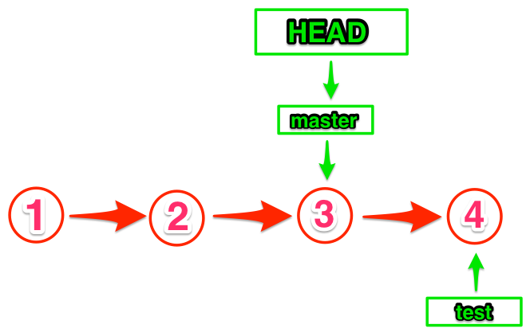

<!-- .slide: data-background="#fff" -->
# <i class="fa fa-code-fork"></i> Git for you and me
### DrupalCorn 2015

## [bit.ly/git-drupalcorn](http://bit.ly/git-drupalcorn)

Note:
- Slides and speaker notes available online

## Alina Mackenzie
#### _University of Illinois at Chicago_

<a href="https://www.drupal.org/u/alimac"><i class="fa fa-drupal"></i> alimac</a>

<a href="https://twitter.com/czaroxiejka"><i class="fa fa-twitter"></i> czaroxiejka</a>

char • o • jay • ka
<!-- .element class="fragment" style="word-spacing: 8px;" -->

Note:
- Developer and system administrator based in Chicago
- Doing Drupal for ~4 years, active in the community for ~2 years
- Using git for ~2 years

## Plan

Note:
- Beginner session: introducing concepts, sprinkling with tips
- Healthy dose of resources for beginners

<!-- .slide: data-background="custom/images/clement127-chemical-experiment.jpg" style="text-align: left;" data-state="show-header" data-header="Photo: CC-BY-NC-ND clement127 https://flic.kr/p/pZg3v (cropped)" -->
## Why?
<!-- .element class="heading" -->
 

history
<!-- .element class="fragment heading invert" -->

undo
<!-- .element class="fragment heading invert" -->

experiment
<!-- .element class="fragment heading invert" -->

Note:
- "Everybody's doing it."
- 3 reasons:
 1. write project history
 1. undo changes (thanks to history)
 1. experiment and track changes

<!-- .slide: data-background="custom/images/boris-baldinger-sprinting.jpg" style="text-align: left;" data-state="show-header" data-header="Photo: CC-BY Boris Baldinger https://flic.kr/p/ps8ZgK (cropped)" -->
## How?
<!-- .element class="heading" -->
 

single user
<!-- .element class="fragment heading invert" -->

collaborative
<!-- .element class="fragment heading invert" -->

Note:
- single-user: local, or local+remote
- collaborative: local+remote
- code, websites, books, slides

## Distributed or centralized?

Note:

<!-- .slide: data-state="show-header" data-header="Diagram by Scott Chacon and Ben Straub, git-scm.com" -->
## Centralized

Note:
- Client-server model
- Local checkout of recent files
- Full history of the project is on a central server
- Example: CVS, Subversion

<!-- .slide: data-state="show-header" data-header="Diagram by Scott Chacon and Ben Straub, git-scm.com" -->
## Distributed

Note:
- Each developer works directly with their own local repository
- Changes are shared between repositories as a separate step
- Full history in every repository
- Agreement on which is the authoritative repository
- Example: Mercurial, Git

## Hosting
- [GitHub](https://github.com) <i class="fa fa-github-square"></i>
- [BitBucket](https://bitbucket.org) <i class="fa fa-bitbucket-square"></i>
- [GitLab](https://gitlab.com/users/sign_in)

Note:
- GitHub: free public repos, pay for private. GitHub Education: student developer pack
- BitBucket: unlimited public and private, free for up to 5 users, academic plan
- GitLab: free unlimited public/private repositories, unlimited private collaborators

### Self-hosted
- [GitLab CE](https://about.gitlab.com/downloads/)

Note:
- Community edition. Free.
- Need your own server.
- Digital Ocean has one-click install.

## <i class="fa fa-terminal"></i> Command line
Update to the latest version (2.5.0)
<!-- .element: class="fragment" -->

Note:
- Download for Windows, comes with OS X, Linux
- Tip: update for latest features

## <i class="fa fa-desktop"></i> Apps
- [SourceTree](https://www.sourcetreeapp.com/)
- GitHub for [Windows](https://windows.github.com/) and [Mac](https://mac.github.com/)
- [SmartGit](http://www.syntevo.com/smartgit/)

Note:
- SourceTree: OS X, Windows. Free
- GitHub for: OS X, Windows. Free. [GitHub Desktop](https://desktop.github.com/) - join waitlist
- SmartGit: cross-platform. Commercial license, non-commercial license

## SourceTree

Note:
- Same concepts (add, remove, branch, merge) apply
- At-a-glance view of the repository vs. command at a time

## Configure git
- system <i class="fa fa-laptop"></i>
- global <i class="fa fa-user"></i>
- local <i class="fa fa-folder-open"></i>

Note:
Configuration has scope:
- system-wide (for all users of a system)
- global (for all of user's projects)
- local (for a specific project)

### Name and email address

~~~ git
git config --global user.name "Alina Mackenzie"
git config --global user.email hello@alim.ac
~~~

### Try these
~~~ git
git config --global color.ui true
git config --global core.excludesfile /path/to/home/directory/.gitignore
git config --global core.whitespace trailing-space
~~~

Note:
- have git use colors in output
- ignore certain files globally: .DS\_Store, \*.swp
- show trailing whitespace

## Sample project
- local repository
- remote repository

### Packing list
- <i class="fa fa-folder-open"></i> packing-list
 - <i class="fa fa-file-text-o"></i> README.md

 

~~~ markdown
# Packing List

Things to bring.
~~~

### Initialize repository

~~~ bash
$ cd packing-list
$ git init
  Initialized empty Git repository in /Users/alimac/packing-list/.git/
~~~

 

- <i class="fa fa-folder-open"></i> packing-list
 - <i class="fa fa-file-text-o"></i> README.md
 - <i class="fa fa-folder-open"></i> **.git**

Note:
- **.git/** is a hidden folder where your repository's snapshots and history are stored

<!-- .slide: style="text-align: left;" data-background="custom/images/jurgen-mangelsdorf-waxing-moon.jpg" data-state="show-header" data-header="Photo: CC-BY-NC-ND Jürgen Mangelsdorf https://flic.kr/p/dUzdPx (cropped)" -->
## Phases
<!-- .element class="heading" -->
 

Untracked
<!-- .element class="fragment heading highlighter" -->

Tracked
<!-- .element class="fragment heading highlighter" -->

Staged
<!-- .element class="fragment heading highlighter" -->

Committed
<!-- .element class="fragment heading highlighter" -->

Pushed
<!-- .element class="fragment heading highlighter" -->

Note:
- Untracked: Git sees file, but doesn't know about it
- Tracked: Git knows about file and tracks changes
- Staged: Changes are ready to be commited
- Committed: Changes to the file are saved to project history
- Pushed: Changes are pushed to remote repository

## Sidekicks
> Where am I?

> What is going on?

> What just happened?

Note:
- The "three sidekicks" are 3 useful commands for orienting yourself in a project.

### git status
~~~ git
$ git status
  On branch master

  Initial commit

  Untracked files:
    (use "git add <file>..." to include in what will be committed)

    README.md

  nothing added to commit but untracked files present (use "git add" to track)
~~~

Note:
- tells us which branch are we on
- Initial commit means there is no history written yet
- shows untracked files
- gives hints

#### git add
~~~ Git
$ git add README.md
$ git status
  On branch master

  Initial commit

  Changes to be committed:
    (use "git rm --cached <file>..." to unstage)

    new file:   README.md
~~~

Note:
- `git add` has 2 uses:
 - start tracking a file
 - stage a file that is ready to be committed

#### <i class="fa fa-file-text-o"></i> README.md
~~~ markdown
# Packing List

Things to bring.

laptop
skirt with pockets
toothbrush
~~~

Note:
- adding a few items to the list

#### git status
~~~
$ git status
  On branch master
  Initial commit

  Changes to be committed:
    (use "git reset HEAD <file>..." to unstage)

    modified:   README.md

  Changes not staged for commit:
    (use "git add <file>.." to update what will be committed)
    (use "git checkout -- <file>..." to discard changes in working directory)

    modified:   README.md
~~~
<!-- .element: class="small-code" -->

Note:
- Still initial commit
- Some changes are staged, some are not
- Git keeps track of sets of changes within the same file

### git diff
~~~
$ git diff
  diff --git a/README.md b/README.md
  index daa8d60..da0a4b2 100644
  --- a/README.md
  +++ b/README.md
  @@ -1,3 +1,7 @@
   # Packing List

   Things to bring.
  +
  +laptop
  +skirt with pockets
  +toothbrush
~~~

Note:
- `git diff` shows changes between two versions of a file, changes that have not been staged yet
- added lines are prefixed with a +
- removed lines are prefixed with a -

#### git commit

~~~ git
$ git commit -m "Initial commit."
  [master (root-commit) 1c50eb4] Initial commit.
  1 file changed, 3 insertions(+)
  create mode 100644 README.md
~~~
<!-- .element: class="large-code" -->

Note:
- To **commit** is to write something down as history
- `git commit -m` is a shortcut to do the commit in one line
- `git commit` will open a text editor to write the commit message

### git log

~~~ git
$ git log
  commit b9fd7596e44051a99b683a19982c592fdcbca5a5
  Author: Alina Mackenzie <hello@alim.ac>
  Date:   Wed Mar 8 12:10:25 2015 -0500

    Initial commit.
~~~
<!-- .element: class="large-code" -->

Note:
- `git log` shows commit hash, author, date and message

## Commit

> A set of related and reversible changes that function together as a unit of work.

Note:
- up to each developer to decide
- when on a team, agree on conventions and document them
- beware of unrelated changes, changes outside of the scope
- base commits on tickets

### Interactive staging
~~~
git add -p
~~~
<!-- .element: class="large-code" -->

Note:
- git will ask which changes to stage
- But it will only ask about changes to tracked files
- Use `git status` to find any new, untracked files

### <i class="fa fa-file-text-o"></i> README.md
~~~
# Packing List

Things to bring.

## Technology
laptop

## Clothes
skirt with pockets

## Toiletries
toothbrush
~~~

Note:
- Adding headings to separate items into categories

### git add -p
~~~
diff --git a/README.md b/README.md
index da0a4b2..9e775a7 100644
--- a/README.md
+++ b/README.md
@@ -2,6 +2,11 @@

 Things to bring.

+## Technology
 laptop
+
+## Clothes
 skirt with pockets
+
+## Toiletries
 toothbrush
Stage this hunk [y,n,q,a,d,/,s,e,?]?
~~~
<!-- .element: class="small-code" -->

Note:
- y: yes, n: no, q: quit
- a: stage this hunk and all later hunks
- /: search for a hunk matching the given regex
- d: do not stage this hunk or any of the later hunks in the file
- s: split, e: edit, ?: help

### Split
~~~
Stage this hunk [y,n,q,a,d,/,s,e,?]? s
Split into 3 hunks.
@@ -2,4 +2,5 @@

 Things to bring.

+## Technology
 laptop
Stage this hunk [y,n,q,a,d,/,j,J,g,e,?]?
~~~

Note:
- changes are split into smaller chunks, or hunks
- `git add -p`: Stage only the changes you want.
- `git reset -p`: does the same, but for unstaging.

### Editor
~~~
git config --global core.editor sublime
~~~
<!-- .element: class="large-code" -->

Note:
Change default editor to [Sublime Text](http://olivierlacan.com/posts/launch-sublime-text-3-from-the-command-line/), [Atom](https://help.github.com/articles/associating-text-editors-with-git/)

### Message
~~~
Add short descriptive subject line.

Longer description in the form of paragraphs
that include reasons for the change, reference
tickets or other commits.
~~~
<!-- .element: class="large-code" -->

Note:
- Imagine saying "This commit will..." before writing the message
- Short subject, blank line, longer message
- Prefix with a ticket number

## Push
~~~
git add remote origin git@bitbucket.org:alimac/packing-list.git
~~~
<!-- .element: class="large-code" -->

Note:
- Add a remote repository

### git push
~~~
git push -u origin master
~~~
<!-- .element: class="large-code" -->

## Undo

### Not committed yet

#### Unstage a file
~~~
$ git reset HEAD README.md
$ git reset -p
~~~
<!-- .element: class="large-code" -->

#### Undo all changes to a file
~~~
$ git checkout -- README.md
~~~
<!-- .element: class="large-code" -->

### Committed but not pushed?
#### Update last commit
~~~
$ git commit --amend
~~~
<!-- .element: class="large-code" -->

#### Undo last commit
~~~
$ git reset --soft HEAD~1
$ git reset HEAD~1
~~~
<!-- .element: class="large-code" -->

Note:
- You can always amend the last commit
- Undo a commit and keep files staged
- Undo a commit and unstage files

### More than one commit
#### Undo last 3 commits
~~~
$ git reset --soft HEAD~3
$ git reset HEAD~3
~~~

#### Undo a specific commit
~~~
$ git revert 617ff153
~~~

Note:
- Undo last 3 commits
- Undo last 3 commits and unstage files
- Revert a specific commit. This will create a new commit.

### Pushed?
**Don't do it.**  <!-- .element: class="fragment" style="color: #c00;" -->

Note:
- If you pushed to remote repository, use `revert` to undo.
- If you are the only contributor, `git push -f <remote> <branch>` will force an update

## Branch

Note:
- cheap way to create copies of the project
- multiple copies in one directory
- easy to integrate

### git status

Note:
- Starting point
- HEAD is a special pointer that points to where we are now

### git branch test

Note:
- Create branch test

### git checkout test

Note:
- Switch to test branch

### Make a commit to test branch

Note:
- Experiment and commit changes

### Switch back to master

Note:
- HEAD now points to master branch

## Merge

~~~
git checkout master
git merge test
~~~

### Fast-forward merge

Note:
- master branch hasn't changed, move to last commit of test

### Divergent branches

Note:
-

### Merge commit

Note:
-

## Rebase

## Conflicts

Note:
- Conflicts occur when same lines are modified in different ways

<i class="fa fa-git-square"></i>
- stop activity (merge, rebase) <!-- .element: class="fragment" -->
- list files with conflicts  <!-- .element: class="fragment" -->

<i class="fa fa-user"></i>
- resolve conflicts  <!-- .element: class="fragment" -->
- stage files to mark as resolved  <!-- .element: class="fragment" -->

### <i class="fa fa-file-text-o"></i> README.md
~~~
Things to bring.
~~~
<!-- .element: class="large-code" -->

### Contributor 1
~~~
Things to bring on a trip.
~~~
<!-- .element: class="large-code" -->
 

### Contributor 2
~~~
Things to bring on an expedition.
~~~
<!-- .element: class="large-code" -->

### Conflict markers
~~~
<<<<<<< HEAD
Things to bring on a trip.
=======
Things to bring on an expedition.
>>>>>>> expedition-branch
~~~
<!-- .element: class="large-code" -->

Note:
- 7 less-thans, 7 greater thans, separated by 7 equals signs
- Replace text between markers with your resolution
- Delete markers

### Resolve
~~~
Things to bring on adventures.
~~~
<!-- .element: class="large-code" -->

`git add <file>`

## What next?

### Git Immersion
#### [gitimmersion.com](http://gitimmersion.com)

Note:
- guided tour that walks through the fundamentals of Git
- inspired by the premise that to know a thing is to do it
- for step-by-step learners

### Try Git
#### [try.github.io](http://try.github.io)

Note:
- created by Code School, sponsored by GitHub
- in browser tutorial
- for instant gratification

### Visualizing Git Concepts with D3
#### [onlywei.github.io/explain-git-with-d3](http://onlywei.github.io/explain-git-with-d3)

Note:
- D3.js is a JavaScript library for data visualization
- Animates git concepts like branching, pushing, merging
- for visual learners of git concepts

### Git for Teams
#### [gitforteams.com](http://gitforteams.com)

Note:
- comprehensive look at using git for teams of people
- for people who are looking for strategies to integrate git into existing teams

### Pro Git
#### [git-scm.com/book/en/v2](https://git-scm.com/book/en/v2)

Note:
- in-depth look at git, including what's inside git
- for people who like to take things apart to learn
